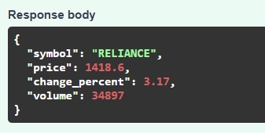
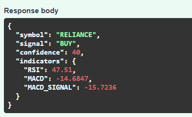
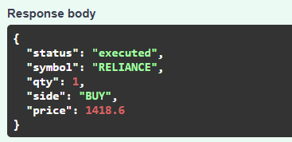
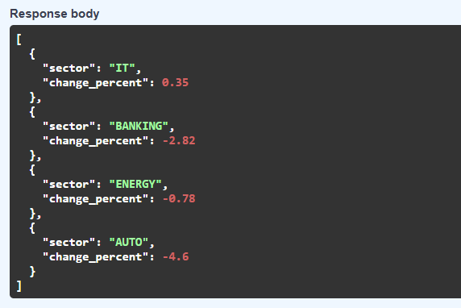

# IndiaQuant MCP – AI-Powered Stock Market Assistant

IndiaQuant MCP is a real-time AI-powered market intelligence system built using the **Model Context Protocol (MCP)**.  
It provides live stock data, trading signals, options analytics, sentiment analysis, and portfolio simulation using **100% free APIs**.

The system exposes these capabilities as MCP-compatible tools so an AI agent (like Claude Desktop) can query and analyze financial markets in real time.

---

# Project Architecture

```
AI Agent (Claude / AI Assistant)
        │
        ▼
MCP Tool Server (FastAPI)
        │
        ├── Market Data Engine
        ├── Signal Generator
        ├── Options Analyzer
        ├── Greeks Calculator
        ├── Portfolio Manager
        ├── Sentiment Analyzer
        ├── Market Scanner
        └── Sector Heatmap
        │
        ▼
External APIs
   ├── Yahoo Finance (yfinance)
   ├── NewsAPI
   └── Alpha Vantage (optional)
```

The system is designed as a **modular financial intelligence platform**, where each component provides a specific capability.

---
# Project Structure

```
indiaquant-mcp
│
├── app
│   ├── market_data
│   ├── signals
│   ├── options
│   ├── analytics
│   ├── portfolio
│   └── mcp
│
├── screenshots
│   ├── live_price.png
│   ├── signal.png
│   ├── trade.png
│   └── heatmap.png
│
├── main.py
├── config.py
├── requirements.txt
└── README.md
```
---

# MCP Tools Implemented

The following **10 MCP tools** are implemented as required by the assignment.

| Tool | Description |
|-----|-------------|
| `get_live_price` | Fetches live stock price and market data |
| `generate_signal` | Generates BUY/SELL/HOLD signal using technical indicators |
| `get_options_chain` | Retrieves options chain data |
| `calculate_greeks` | Computes Black-Scholes Greeks |
| `place_virtual_trade` | Simulates buy/sell trades |
| `get_portfolio_pnl` | Calculates portfolio profit and loss |
| `analyze_sentiment` | Performs sentiment analysis on financial news |
| `detect_unusual_activity` | Detects unusual options activity |
| `scan_market` | Scans market for oversold stocks |
| `get_sector_heatmap` | Displays sector performance heatmap |

All tools return **live market data using free APIs**.

---

# Core Modules

## Market Data Engine

Uses **yfinance** to fetch real-time market data.

Capabilities:

- Live stock prices
- Historical OHLC data
- Volume and price change analysis
- Supports NSE and global stocks

Example response:
```json
{
"symbol": "RELIANCE",
"price": 1418.6,
"change_percent": 3.17,
"volume": 34897
}
```

---

# AI Trade Signal Generator

Generates trading signals using technical indicators:

Indicators used:

- RSI
- MACD
- Bollinger Bands

Signal output:
BUY / SELL / HOLD
confidence score

Example:
```json
{
"symbol": "RELIANCE",
"signal": "BUY",
"confidence": 40
}
```

---

# Options Chain Analyzer

Retrieves options data and performs analysis including:

- Open Interest tracking
- Max Pain calculation
- Options volume comparison
- Unusual activity detection

This helps identify **potential institutional trading behavior**.

---

# Greeks Calculator

Implements the **Black-Scholes model from scratch**.

Greeks calculated:

- Delta
- Gamma
- Theta
- Vega

Example:

```json
{
  "delta": 0.2265,
  "gamma": 0.026248,
  "theta": -0.06355,
  "vega": 0.172592
}
```

---

# Portfolio Risk Manager

Simulates a virtual trading portfolio using **SQLite**.

Features:

- Place virtual buy/sell trades
- Track portfolio positions
- Real-time PnL calculation
- Trade history storage

Example:
POST /place_virtual_trade
```json
{
"symbol": "RELIANCE",
"qty": 1,
"side": "BUY"
}
```

---

# Sentiment Analysis

Uses **NewsAPI** to analyze market sentiment from financial news.

Process:

1. Fetch recent headlines
2. Score sentiment based on keywords
3. Generate sentiment signal

Example output:

```json
{
  "symbol": "RELIANCE",
  "sentiment_score": 2,
  "signal": "POSITIVE"
}
```

---

# Market Scanner

Scans multiple stocks to find **oversold opportunities**.

Criteria:
RSI < 30

Example response:
```json
[
{
"symbol": "AAPL",
"RSI": 28.3,
"signal": "OVERSOLD"
}
]
```

---

# Sector Heatmap

Analyzes sector performance by aggregating stock movements.

Example output:
```json
[
{"sector": "IT", "change_percent": 0.35},
{"sector": "BANKING", "change_percent": -2.82},
{"sector": "ENERGY", "change_percent": -0.78},
{"sector": "AUTO", "change_percent": -4.6}
]
```

---

# Technologies Used

Core stack:

- Python
- FastAPI
- SQLite
- yfinance
- pandas
- numpy
- NewsAPI

Libraries:
fastapi
uvicorn
pandas
numpy
yfinance
newsapi-python
sqlite3

---

# Installation

Clone repository


git clone https://github.com/sowjanya5751/indiaquant-mcp.git

cd indiaquant-mcp


Create virtual environment

Windows


python -m venv venv
venv\Scripts\activate


Linux / Mac


python -m venv venv
source venv/bin/activate


Install dependencies


pip install -r requirements.txt


---

# Running the MCP Server

Start the server:


uvicorn app.mcp.mcp_server:app --reload


Server will start at:


http://127.0.0.1:8000


---

# API Endpoints

| Endpoint | Method | Description |
|--------|--------|-------------|
| `/get_live_price` | POST | Fetch live stock price |
| `/generate_signal` | POST | Generate trading signal |
| `/get_options_chain` | POST | Retrieve options data |
| `/calculate_greeks` | POST | Compute Black-Scholes Greeks |
| `/place_virtual_trade` | POST | Execute simulated trade |
| `/get_portfolio_pnl` | GET | Calculate portfolio PnL |
| `/analyze_sentiment` | POST | Analyze financial news sentiment |
| `/detect_unusual_activity` | POST | Detect unusual options activity |
| `/scan_market` | GET | Find oversold stocks |
| `/get_sector_heatmap` | GET | Sector performance overview |

---

# API Documentation

Interactive API documentation is available at:


http://127.0.0.1:8000/docs


Swagger UI allows testing all MCP tools directly.

---

# Design Decisions

FastAPI was chosen because:

- High performance async framework
- Automatic API documentation
- Ideal for MCP tool integration

SQLite was used because:

- Lightweight database
- Perfect for portfolio simulation
- Easy local deployment

yfinance provides:

- Free stock market data
- Historical price access
- Options chain support

---

# Future Improvements

Possible extensions:

- Real-time WebSocket streaming
- Machine learning trading models
- Redis caching for faster data retrieval
- Cloud deployment (AWS / GCP)
- Advanced portfolio risk analytics

---

# Assignment Requirements Fulfilled

✔ Real-time market data  
✔ 10 MCP tools implemented  
✔ Options analysis and Greeks calculation  
✔ Sentiment analysis using NewsAPI  
✔ Virtual trading portfolio  
✔ Modular system architecture  
✔ API-based MCP server compatible with AI agents

---
## API Demo

### Live Price


### Trade Signal


### Portfolio Trade


### Sector Heatmap

## Conclusion

IndiaQuant MCP demonstrates how AI agents can interact with financial markets through modular tools and real-time data pipelines.

The system combines **quantitative analysis, market intelligence, and AI integration** into a unified platform capable of supporting advanced trading insights.
